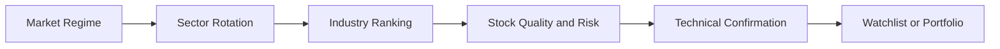

# Stockfinder Product Vision and Requirements

This document captures the product discovery interview for the Stockfinder
Streamlit application.

## Product Vision

Stockfinder is a private investment decision-support application for an
investor and trader. It provides a structured, top-down process for identifying
strong markets and industries, selecting high-quality securities within those
industries, evaluating their risk, and confirming potential entries with
technical analysis.

The long-term product should cover stocks, ETFs and funds, indices, metals, and
commodities. The first usable milestone focuses on US stocks.

## Decision Workflow

1. Evaluate the macroeconomic environment and overall market regime.
2. Identify sectors and industries showing relative strength and probable
   institutional accumulation.
3. Drill into favored industries and rank their constituent stocks.
4. Evaluate the fundamental quality and risk of each stock.
5. Use price structure, moving averages, and volume as technical confirmation.
6. Inspect a detailed security analysis.
7. Add promising candidates to a watchlist or portfolio.

## Target User

The initial application is intended for a single private investor and trader.
The deployed application should be accessible only to its owner.

## Analytical Framework

The application should present separate, transparent scores for fundamental
quality, risk, and technical confirmation. It should not conceal materially
different analytical dimensions inside a single unexplained score.

### Fundamental Quality

The fundamental evaluation should consider:

- Revenue and earnings growth, including consistency and available estimates
- Profitability, return on equity, return on invested capital, and margins
- Operating and free cash flow
- Earnings quality and cash conversion
- Debt, liquidity, interest coverage, and overall financial stability
- Valuation relative to growth, history, and industry peers
- Dividends, dividend coverage, and share buybacks
- Company outlook and order backlog when reliable data is available
- Evidence of a durable competitive advantage or economic moat

Fundamentals and risk should establish whether a security is a suitable
candidate before technical signals are used for timing and confirmation.

### Risk Assessment

The risk analysis should include:

- Historical volatility and drawdown
- Liquidity and concentration risk
- Balance-sheet and earnings risk
- Average True Range (ATR)
- Relevant support levels
- Candidate stops based on ATR, the 50-day moving average, and recent swing lows
- A configurable trailing stop
- Position sizing based on account risk per trade

All stop levels are analytical candidates rather than trade instructions.

### Technical Confirmation

The technical evaluation should include the three "Power Moves":

1. **Heartbeat pattern:** higher highs, higher lows, constructive
   consolidations, and pullbacks holding above prior support.
2. **Moving averages:** price in relation to upward-sloping 50-day and 150-day
   moving averages, including prior tests of those averages.
3. **Volume:** above-average volume on advances, lower volume on declines,
   expansion at important levels, and signs of accumulation or distribution.

Additional technical inputs should include relative strength against relevant
benchmarks and industry peers.

### Sector Rotation and Institutional Activity

Sector and industry analysis should consider:

- Relative performance over daily, weekly, and monthly periods
- Price-volume behavior
- Breadth across securities within each group
- Sector ETF flow estimates where reliable data is available
- Institutional holdings and changes in ownership
- Insider purchases and sales
- Alignment with macroeconomic, regulatory, technological, or cyclical
  catalysts

Price and volume can suggest institutional accumulation but cannot prove who
caused the activity. The interface must distinguish observed facts from
inferred signals.

## Analysis Profiles

The intended horizons are:

- Day trading
- Swing trading
- Position trading
- Long-term investing

Each horizon should have a separate scoring profile rather than blending
incompatible timeframes. The application should offer conservative, balanced,
and aggressive presets with editable weights and thresholds.

The initial data refresh is daily after the market close. Consequently, the
first release cannot provide true intraday day-trading analysis. Any day-trading
profile must be deferred or clearly identified as an end-of-day setup scanner.

## Market and Security Universe

- Initial market: United States, expanded with curated international local listings
- Initial stock universe: Russell 3000
- Classification hierarchy: GICS sectors and industries
- Broad benchmarks: S&P 500/SPY, Nasdaq 100/QQQ, and Russell 2000/IWM
- Security comparisons: relevant sector ETFs and industry peers
- Refresh frequency: daily after market close

Official Russell 3000 constituents and GICS classifications may carry licensing
restrictions. The implementation may need an open approximation, a licensed
provider, or a user-maintained universe and classification mapping.

## Application Areas

### Market Dashboard

The market dashboard should summarize:

- Major indices, trends, and market breadth
- Interest rates and the yield curve
- Inflation and labor-market indicators
- Volatility and credit conditions
- The US dollar, metals, oil, and other relevant commodities
- Market sentiment indicators
- Economic releases, central-bank events, earnings, and important news

### Sector and Industry Screener

The screener should provide tables, heatmaps, and other suitable visualizations
for understanding sector rotation and possible capital flows. Users should be
able to navigate from the market overview into sectors and industries.

### Industry Drill-Down

An industry view should list and rank its stocks. Each row should include key
scores, classifications, relevant metrics, and a price-chart thumbnail showing
at least the 50-day moving average. Selecting a stock should open its detail
view.

### Security Detail View

The detail view should use modular sections for:

- Interactive price chart with selectable range
- 50-day and 150-day moving averages
- Trading volume
- Fundamental, risk, and technical score breakdowns
- Candidate stop losses and position sizing
- Fundamentals and valuation
- Institutional ownership and insider transactions
- Catalysts, earnings events, and news
- Industry peer and benchmark comparison

### Watchlists

Users should be able to save securities with:

- Notes and an investment thesis
- Planned entry price
- Target price
- Stop price

### Portfolio

The first portfolio implementation should support:

- Manually entered positions
- Live valuation, gains, losses, and allocation
- Portfolio volatility, concentration, drawdown, and correlation analysis

### Methodology and Settings

The application should explain its calculations, sources, score components,
weights, thresholds, assumptions, and known data limitations. Users should be
able to select risk and horizon presets and adjust supported parameters.

## Data and Reliability

Yahoo Finance is the preferred prototype source for market prices, volume, and
available fundamentals. FINVIZ should be used for inspiration and outbound
links rather than as a required scraped-data dependency.

The first release should use free sources only. Providers should be replaceable
so that higher-quality sources can be introduced later. Critical values should
be cross-checked when an independent source is available.

Data retrieval should be robust and favor accuracy over speed. The application
should provide:

- Source names and retrieval timestamps
- Caching appropriate for end-of-day analysis
- Retries and graceful handling of unavailable providers
- Missing and stale-data indicators
- Confidence or completeness information where appropriate
- Clear separation between reported values, calculated values, and inferences

Free providers may not reliably supply fund flows, institutional holdings,
analyst estimates, insider transactions, order backlogs, economic calendars,
or moat assessments. Missing inputs must reduce score completeness rather than
silently producing misleading scores.

## Persistence and Deployment

- Framework: Streamlit
- Initial storage: local SQLite
- Intended deployment: Streamlit Community Cloud
- Access: private, single user

SQLite is appropriate during local development, but Streamlit Community Cloud
has ephemeral local storage. Durable cloud watchlists and portfolios will
eventually require a hosted database. The first implementation should isolate
persistence behind a repository interface to support that migration.

## Export Requirements

- Export ranked tables and watchlists as CSV
- Export analysis charts as images

## Validation

The methodology should be evaluated through:

- Historical backtests measuring forward returns, drawdowns, and hit rates
- Walk-forward validation that avoids look-ahead bias
- Manual spot checks against trusted charts and source data

Backtests must account for changing index membership, delisted securities,
reporting dates, transaction costs, and survivorship bias whenever the required
data is available.

## First Usable Milestone

The MVP is an end-to-end US stock workflow that allows the user to:

1. Review the market regime.
2. Rank sectors and industries.
3. Open an industry and review ranked stocks.
4. Inspect a stock's fundamentals, risks, technical condition, and peers.
5. Add the stock to a persistent local watchlist.
6. Export the resulting analysis.

ETFs, funds, indices, metals, commodities, cloud persistence, and fully
intraday analysis are follow-on capabilities.

## Success Criteria

The first release is successful when it:

- Produces an up-to-date evaluation of industries and stocks
- Provides transparent fundamental, risk, and technical scores
- Prioritizes fundamental quality and risk before technical confirmation
- Retrieves and validates data robustly
- Makes missing, stale, or conflicting data visible
- Produces relevant candidates that can be checked against the user's manual
  investment process
- Supports repeatable historical and walk-forward evaluation
- Remains useful even when an optional data source is unavailable

The application is a research and decision-support tool. It does not provide
personalized financial advice or guarantee future performance.
