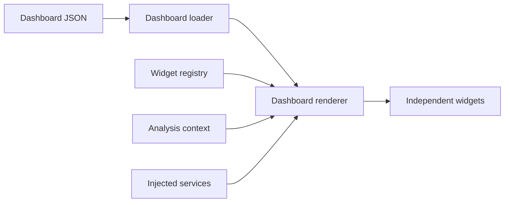

# Dashboard and Widget Architecture

Stockfinder is migrating from fixed Streamlit pages to configuration-driven,
linked dashboards. Existing pages remain available while their behavior moves
into independently testable widgets.

## Runtime Flow

- `dashboard.py` validates dashboard and widget definitions.
- `widget_registry.py` resolves a configured widget type to its renderer.
- `navigation.py` owns the linked Region → Sector → Industry → Instrument context.
- `dashboard_runtime.py` defines the services widgets may use.
- `dashboard_renderer.py` lays out widgets in twelve-column rows.
- `widgets/` contains one module per independently removable widget.

Widgets do not import the application shell or manipulate unrelated page routes.
They receive a `WidgetSpec`, the shared `AnalysisContext`, and explicit services.

## Dashboard Configuration

Packaged layouts are defined in `src/stockfinder/default_dashboards.json`. To
customize a deployment without changing source code, create
`data/dashboards.json`, or place it under `STOCKFINDER_DATA_DIR`.

Each widget specifies:

- `id`: unique instance ID within the dashboard
- `type`: registered widget implementation
- `title`: displayed heading
- `width`: integer from 1 to 12
- `follow_context`: whether it follows and updates shared navigation
- `settings`: widget-specific options

Removing a widget means deleting its JSON object. Adding another instance means
adding an object with a new ID. Rows are filled in order until their widths total
12; the next widget starts a new row.

## Built-in Widgets

### `market_regime`

Analyzes equity trend, breadth, credit appetite, and volatility, then displays
the configured exposure, position-risk, and entry-policy controls.
The same widget separately monitors downside escalation without changing the
configured regime band: a 10% equity drawdown, 25% annualized 20-day equity
volatility, VIX at 25, high-yield credit lagging intermediate Treasuries by 2% over
one month, and a 3% one-month dollar surge. The visible trigger count maps to
Normal, Monitor, Cautious, or Defensive response guidance, and every current value
and threshold remains inspectable in the Evidence section.

### `cross_asset_conditions`

Compares one-, three-, and six-month direction across large and small equities,
high-yield credit, Treasuries, the US dollar, gold, broad commodities, and equity
volatility. Credit appetite, market breadth, and volatility direction are shown
separately rather than hidden in one score.

### `regional_markets`

Ranks configured regional ETF/index benchmarks by momentum, long-term trend, and
relative performance against the global benchmark. Selecting an available region
updates the shared context used by sector, industry, liquidity, and stock widgets.
Benchmark evidence is joined to the scan's regional industry breadth, liquidity,
and rotation averages. Each region is labeled Confirmed leader, Narrow leader,
Internal recovery, Broad weakness, Mixed, or Benchmark only using visible rules;
the complete comparison remains available in the regional evidence table.

### `rotation_explorer`

Provides linked region, sector, and industry selection; rotation-state filtering;
liquidity and breadth evidence; and ranked stocks in the selected industry.
For the selected region, a sector allocation map compares rotation score with
directional flow. Bubble size represents covered stocks and color represents
member-weighted long-term breadth. Sector evidence is labeled Leadership, Narrow
strength, Accumulating, Weak, Mixed, or Insufficient internals before the industry
drill-down; cached scans without native sector breadth reconstruct it from their
industry records.
Industry ranking adds a separate confirmation label from rotation, liquidity,
directional flow, long-term breadth, and covered-member count. Broad leadership
requires confirmation from all four dimensions; Thin leadership explicitly flags
high-scoring groups with weak liquidity, breadth, or fewer than three members. The
underlying values remain available in the industry evidence table.

### `liquidity_breadth`

Shows one-week, one-month, three-month, and six-month liquidity or directional
flow as a heatmap. It follows the selected region and sector and summarizes
liquidity, inferred flow, and breadth above a rising SMA150.

### `ranked_stocks`

Loads stocks for the selected context, enriches them with cached fundamental and
risk evidence, applies the selected swing, position, or investing profile, and
optionally requires membership in the imported broker trading list. Selecting a
row updates the linked instrument-analysis widget.
The same rule evaluator drives both filtering and diagnostics. Excluded candidates
retain explicit reasons such as setup, volatility, safety, fundamental quality,
long-term trend, or broker availability failures; these are available in a separate
evidence table even when other candidates pass.
Every evaluated candidate also receives a weighted profile score and evidence
coverage percentage from setup, safety, fundamentals, and SMA150 trend. Available
components are reweighted when evidence is missing. The weighted minimum remains
an opt-in gate, so existing profiles preserve their prior pass/fail behavior until
it is enabled explicitly. The table can rank by this composite score.

### `instrument_analysis`

Accepts stock, ETF, or index symbols and displays price, independent quality,
safety, and technical scores, plus SMA50/SMA150 price history. It can follow the
instrument selected by another widget or remain pinned to its own symbol.

### `security_score_evidence`

Renders one configured score dimension as an independent component chart. The
Instrument Workbench uses three instances for fundamental quality, safety, and
technical confirmation. Risk components are inverted for display so every panel
consistently treats a higher score as better, while the original observed-risk
label and data completeness remain visible.

### `trade_plan`

Builds an analytical trade plan for the linked instrument using configurable
account value and risk percentage. Conservative, Balanced, and Aggressive
postures select default risk and ATR/trailing-stop distances; ATR, structural,
SMA50, swing-low, and trailing candidates remain visible. Position size is capped
by both the risk budget and available capital, with reward/risk calculated from
the selected entry, stop, and target. Values are labeled in the instrument currency,
and the suggested account size can fund ten shares and risk at least one under the
default stop. These levels are planning aids, not orders.

### `peer_comparison`

Compares the linked instrument with up to five stocks from the same listing region
and industry, ordered by available market capitalization. The benchmark follows
the configured regional industry, sector, then regional benchmark fallback rather
than assuming a US index. Six-month price histories are normalized to growth of
100, with selected-instrument, benchmark, and relative returns shown separately.
Missing histories are excluded and the displayed peer count and benchmark source
make partial coverage explicit. Instruments outside the classified scan universe
remain available to the analysis widgets but cannot receive inferred peers.

### `portfolio_exposure`

Values persistent positions with the latest cached broad-scan prices and joins
their region, sector, industry, and observed market-risk evidence. It displays
unrealized P&L, gross account exposure, largest-position concentration, weighted
safety, and regional and sector allocations. The exposure check automatically
uses the defensive, neutral, or supportive limit selected by the same cross-asset
market-regime model as `market_regime`. Missing quotes are excluded explicitly.
The widget owns persistent add/update/remove controls for positions and watchlist
candidates, and can send a candidate into the shared instrument context. Positions
store an explicit ISO currency and are normalized into a selectable portfolio base
currency using verified Yahoo Finance direct or inverse FX pairs. Synthetic market
fallbacks are never accepted as exchange rates. Legacy position databases migrate
existing rows to USD; users should review that default for older non-US holdings.
Quoted holdings without a verified conversion rate are excluded from account
totals and counted visibly rather than treated as currency parity.

### `alert_center`

Evaluates persistent positions and watchlist plans against configurable thresholds
using the latest cached broad-scan prices and risk scores. Critical alerts cover
position-loss and watchlist-stop breaches; warnings cover position concentration
and weak safety; review alerts identify reached targets and prices near planned
entries. Thresholds are validated and atomically persisted in the shared analysis
configuration, with defaults supplied for older saved configurations. Alerts are
ordered by severity and can send a symbol into the shared instrument context.
This is an end-of-day in-app alert view, not a background or push-notification
service, and symbols without cached quotes cannot trigger price-based conditions.
Optional email delivery is provided by the separate `stockfinder-alerts` command.
It reads the same persistent records and cached evidence without starting
Streamlit, deduplicates unchanged alert sets, and sends one recovery message when
alerts clear. Scheduling remains an explicit deployment concern rather than a
hidden process inside the web application.

### `rule_profile_editor`

Edits and atomically persists setup, volatility, safety, fundamental-quality, and
SMA150 requirements for the existing Swing, Position, and Investing profiles. The
widget uses the same validated configuration store as the legacy Settings page and
can be removed from the dashboard JSON without affecting screening. It also edits
the weighted-score gate and component weights, and provides Momentum-led,
Balanced, and Quality-first composition presets. Applying a preset enables the
weighted gate; all values remain individually editable afterward.

## Adding a Widget Type

1. Add a renderer module under `src/stockfinder/widgets/`.
2. Implement a function accepting `WidgetSpec`, `AnalysisContext`, and
   `DashboardServices`.
3. Register it in `built_in_widget_registry()`.
4. Add the widget type to a dashboard JSON file.
5. Add focused tests for configuration, context behavior, and domain output.

## Migration Roadmap

1. Command center: market regime, rotation explorer, instrument analysis.
2. Complete regional constituent providers and broker-instrument matching.
3. Add macro releases, central-bank events, and validated sentiment providers.
4. Extend profiles with optional strategy-specific rules as needed.
5. Add validated news and sentiment providers.
6. Configure optional delivery schedules on deployed environments.
7. Retire fixed surfaces after equivalent widget workflows pass acceptance tests.
    The fixed Portfolio route and Stocks → Watchlist subview have been removed;
    Stocks research, Settings, Metals, and alternate market/industry views remain
    because they still contain distinct workflows.

## Operations

`stockfinder-alerts` supports externally scheduled, deduplicated email delivery
from persistent cached evidence. `stockfinder-backup` creates and verifies atomic
ZIP archives with per-file SHA-256 checksums, captures SQLite through its online
backup API, and restores only to a new or empty directory. Neither command runs as
a hidden process inside Streamlit; scheduling, secret injection, retention, and
restored-data activation remain explicit deployment responsibilities.

The current international universe remains representative rather than exhaustive.
Completing step 3 requires a reliable constituent/classification provider or a
user-maintained licensed universe; UI modularization alone cannot supply those
missing memberships.